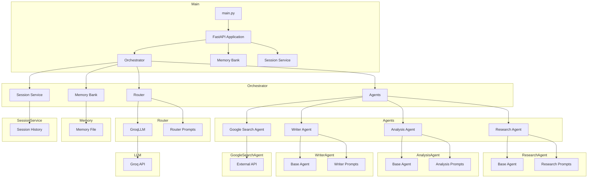

    

    <b>Automatic Architecture Diagrams from Code</b> 
    <a href="https://github.com/swark-io/swark">GitHub</a> • <a href="https://swark.io">Website</a> • <a href="mailto:contact@swark.io">Contact Us</a>

## Usage Instructions

1. **Render the Diagram**: Use the links below to open it in Mermaid Live Editor, or install the [Mermaid Support](https://marketplace.visualstudio.com/items?itemName=bierner.markdown-mermaid) extension.
2. **Recommended Model**: If available for you, use `claude-3.5-sonnet` [language model](vscode://settings/swark.languageModel). It can process more files and generates better diagrams.
3. **Iterate for Best Results**: Language models are non-deterministic. Generate the diagram multiple times and choose the best result.

## Generated Content
**Model**: GPT-4o - [Change Model](vscode://settings/swark.languageModel)  
**Mermaid Live Editor**: [View](https://mermaid.live/view#pako:eNqVlN1SwyAQhV-F4Vp9gF44k9p_G1sbf4f0ApO1ZUwgAnHMOL67CKk4Sdoqd-Es3znsLPnAiUgB93DMN5IWW3QziDkyS5VPbiOkjLut7xWQ3HyfFdUanZ6eoz4ZUaWD5RQFRZGxhGom-NqX923VBVnIZAtKS6qFbMkDEkIuZIX6lL-01CGJQCmDRRHIN5ZAXQE8jXkj628bz7mwnBFZiVLDb3snjEmwAa5VS5jsyeXU6T9yOWdPGFnCjIyleJ3Pw3VTuayzoqUUefETrQvtsnvA2ALmZAUKqGmHK1g3C0IScJpViqk9BVfkXrLvCN3ygoyF2GRgLt9y6exAHcfWedjcwpakTxW0nJx47a_yh27Ul2rYhJa06rZxYuQbctzGtaZhcmU5N90mTrzdNfW4hWtv1NW0hWXdkeG7QZnQyLy_AyQ3xP74xB6_3w33iGWHRrce8nrGPWVqKQ8_j2DClHl01QGSGXR_fGaPP9oX0MyPT3AO0vxnUvNf-oix3kIOMe6hGKfwTMtMx_jTFJVFSjUMGDX8HPe0LOEE01KLqOLJ7luKcrPFvWeaKfj8ArAMeiA) | [Edit](https://mermaid.live/edit#pako:eNqVlN1SwyAQhV-F4Vp9gF44k9p_G1sbf4f0ApO1ZUwgAnHMOL67CKk4Sdoqd-Es3znsLPnAiUgB93DMN5IWW3QziDkyS5VPbiOkjLut7xWQ3HyfFdUanZ6eoz4ZUaWD5RQFRZGxhGom-NqX923VBVnIZAtKS6qFbMkDEkIuZIX6lL-01CGJQCmDRRHIN5ZAXQE8jXkj628bz7mwnBFZiVLDb3snjEmwAa5VS5jsyeXU6T9yOWdPGFnCjIyleJ3Pw3VTuayzoqUUefETrQvtsnvA2ALmZAUKqGmHK1g3C0IScJpViqk9BVfkXrLvCN3ygoyF2GRgLt9y6exAHcfWedjcwpakTxW0nJx47a_yh27Ul2rYhJa06rZxYuQbctzGtaZhcmU5N90mTrzdNfW4hWtv1NW0hWXdkeG7QZnQyLy_AyQ3xP74xB6_3w33iGWHRrce8nrGPWVqKQ8_j2DClHl01QGSGXR_fGaPP9oX0MyPT3AO0vxnUvNf-oix3kIOMe6hGKfwTMtMx_jTFJVFSjUMGDX8HPe0LOEE01KLqOLJ7luKcrPFvWeaKfj8ArAMeiA)

